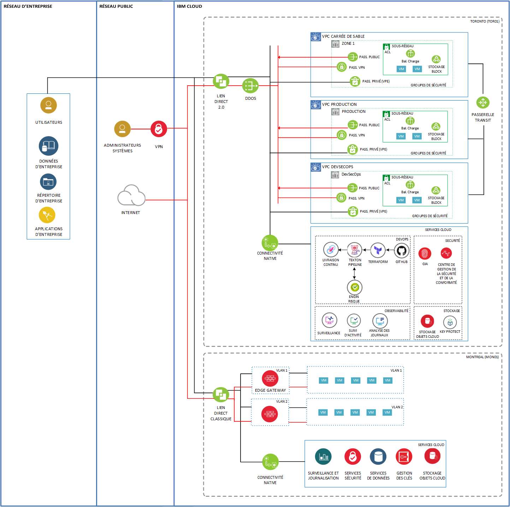

# Zone d'accueil sécurisée du Gouvernement du Québec sur IBM Cloud

Ceci est le dépôt central pour le déploiement automatisé de la zone d'accueil CEI/ITQ du gouvernement du Québec.

## Aperçu

[Automatisation de IBM Cloud pour services financiers avec Terraform](https://github.ibm.com/gsi-labs/ibmcloud-reference-architectures) et [Zone d'accueil sécurisé de base IBM (SLZ) pour VPC](https://github.ibm.com/slzone) rassemble la documentation et l'automatisation requise afin de permettre le déploiement d'un modèle basé sur l'architecture de référence IBM Cloud pour services financiers.

### Valeur ajouté

La zone d'accueil sécurisée IBM a pour but de permettre le déploiement d'une architecture et d'un cadre de référence avec des contrôles préconfigurés. Cela permet d'utiliser des outils pour aider à assurer la sécurité et la conformité avec des contrôles de sécurité et de conformité prescriptifs, intégrés et automatisés pour les modèles d'applications cibles. 
Ces modèles seront utilisés pour créer et permettre un déploiement automatisé rapide de l'infrastructure de l’ITQ pour répondre à différents types de charges de travail qui fournissent un ensemble de base de capacités pour soutenir les VPC en utilisant l'architecture de référence.

## Services et composantes configurées

Exemple de déploiement d'infrastructure automatisée:

1. Toronto Single Zone Region (SZR)
2. Un VPC carré de sable, Production, DevSecOps avec la possibilité de modifier les noms, les sous-réseau pour chacun des déploiement. Il est aussi possible d'ajouter des VPC au besoin.
3. Passrelle de transit
4. Le minimum requis pour s'assurer d'atteindre la validité du IBM Cloud services financiers inclus: 
   - IBM Cloud Log Analysis
   - IBM Cloud Monitoring
   - IBM Cloud Activity Tracker ([Comment configurer l'acheminement des évènements](https://cloud.ibm.com/docs/activity-tracker?topic=activity-tracker-getting-started-routing))
   - IBM Cloud Keyprotect
5. Passerelle VPE pour chacun des VPC déployés.
6. Passerelle VPN optionnel pour la gestion de chacun des VPC.
7. Balancement de charge privé pour les charges dans chcun des VPC ([Comment activer?](https://github.ibm.com/fs-cloud-canada/air-canada-automation/blob/master/docs/markdowns/extensions.md))

Pour plus de détail concernant le IBM Cloud pour services financiers se retrouve ici: [Référence IBM services financiers](https://test.cloud.ibm.com/docs/allowlist/framework-financial-services).

## Pré-requis

Avant de déploiyer la zone sécuritaire du gouvernement du Québec CEI/ITQ, vous devez compléter les pré-requis suivants:

Un compte IBM Cloud est requis. Un compte d'entreprise est recommandé mais un service "Pay as you Go" est suffisant pour déployer la zone d'accueil.

Si vous ne possédez pas encore de compte IBM Cloud, suivre la procédure suivante:
 
- Configuration d'un compte IBM Cloud [ici](./docs/markdowns/PrerequisitesSetup.md)
- Configuration d'un compte IBM Cloud pour la zone d'accueil sécurisé [ici](./docs/markdowns/PrerequisitesSetup.md)
- Configuration des accès du compte (IBM Cloud IAM) [ici](./docs/markdowns/PrerequisitesSetup.md)
- Création des accès IAM et des groupes de ressources pour les items de la zone d'accueil sécurisé [ici](./docs/markdowns/PrerequisitesSetup.md)
- Guide de configuration du répertoire [ici](./docs/markdowns/PrerequisitesSetup.md)
- Configuration de l'outil CLI [ici](./docs/markdowns/PrerequisitesSetup.md) (optionel)

## Architecture de la solution

Cliquer pour agrandir 

## Connexion au répo Git pour la zone d'accueil sécurisé

Aller à https://github.ibm.com/fs-cloud-canada/Quebec-Gov-SLZ et connecter le répo de votre entreprise à github.ibm.com

Parcourez vore répertoire connecté. Il se trouve à https://\<github>/\<your-org>/Quebec-Gov-SLZ. Vous aller ensuite créer le déploiement automatisé à l'aide de Toolchain à partir de votre propre répo Git.

## Définition de l'état désiré pour le déploement de la zone d'accueil

Ajuster les paramètres de le déploiement de la zone d'accueil sécurisé à l'aide des variables d'environnement Terraform situ dans votre répertoire de répo. Ceci permet de garder une trace des changement que vous avez effectué.

Il est recommandé de créer votre propre fichier `.tfvars` avec des valeurs qui représente l'environnement que vous allez déployer. Tout les changements que vous allez faire au fichier`.tfvars` devraient préalablement être sauvegardé dans votre propre répo. Toolchain utilisera directement ce fichier.

Le script présent dans ce répo a été testé en utilisant [devtest.tfvars](./terraform/env/devtest.tfvars). Vous pouvez utiliser ce fichier comme base pour définir votre propre environnement.

Le modèle de déploiement consiste en 2 étapes:

- [Bootstrap Services](./docs/markdowns/deployment.md)  
- [Pattern Services](./docs/markdowns/deployment.md) 

Pour démarrer le déploiement avec Toolchain, commencer par compléter les instructions sur comment configurer votre répo Git et Toolchain [ici](https://github.ibm.com/fs-cloud-canada/Quebec-Gov-SLZ/tree/master/docs/demo)

Ensuite, suivre les [instructions de déploiement](./docs/markdowns/deployment.md)

Note: Pour exécuter le déploiement manuellement à partir d'un poste local, configurer l'outil CLI documenté [ici](./docs/markdowns/terraform_install.md).

## Création d'un collecteur pour le Centre de sécurité et de conformité (SCC) 
Compléter les étapes suivantes après le déploiement de la zone d'accueil. 

[Instructions](./docs/markdowns/scc_config.md) pour créer un collecteur, la portée ainsi qu'un balayage de ressource. Pplus ample informations sur l'utilisation du Centre de sécurité et de conformité sont disponible [ici](https://cloud.ibm.com/docs/security-compliance?topic=security-compliance-getting-started)

## Référence de développement

L'information pour les développeur afin de personaliser les scripts de la zone d'accueil sécurisé [Référence de développement](./docs/markdowns/developer-ref.md)

### Validation post déploiement

Après avoir exécuter les instructions de déploiement, vérifier si Toolchain a terminé en succès [Vérification Toolchain](./docs/markdowns/deployment.md)

