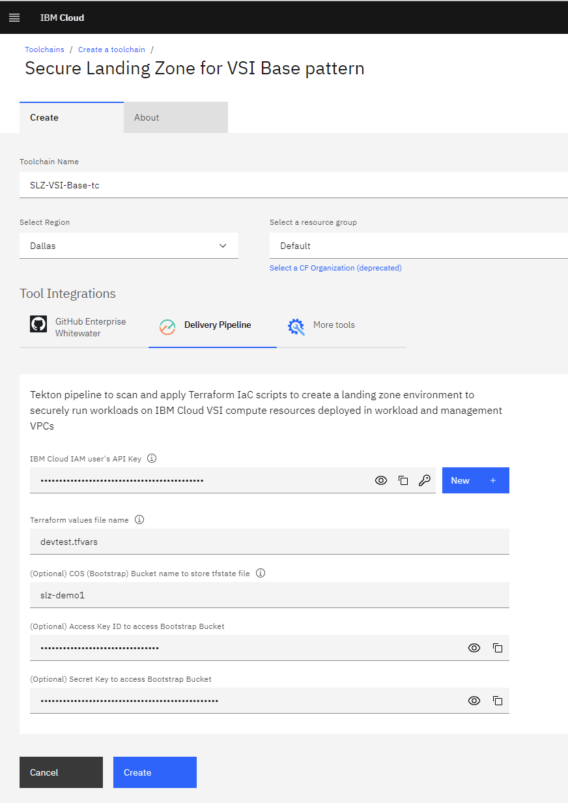

# Demo SLZ

0. If you are running for the first time, you might need to authorize IBM Toolchain to access your repository. You will need to follow the instructions on [this repo](https://github.com/maire-kehoe/whitewater-ref-toolchain) to authorize toolchains to access Github Enterprise. 

   You do not have to create the toolchain, but only get to the "Authorize" button that you see on the first page after clicking the "Create Toolchain" button. If you do not see an "Authorize" button, you already have Toolchain Authorized to use Github Enterprise.

   Note: You can check the current authorization by going to [https://cloud.ibm.com/devops/git?env_id=ibm:yp:us-south](https://cloud.ibm.com/devops/git?env_id=ibm:yp:us-south)

   

1. Go to [Demo Repository's deployment page](https://github.ibm.com/fs-cloud-canada/air-canada-automation/blob/master/docs/markdowns/deployment.md)

2. Click on "Create Toolchain" button
   

3. The create toolchain wizard will come up.

   Make sure you update the following:

   - Toolchain Name: SLZ-\<myname>
   - Resource Group: slz-shared-demo-rg
   - Uncheck "Track deployment of code changes"

   

4. Fill in the delivery pipeline details.

   _Note: These should be provided by the SLZ team._

   Fields to be filled in:

   

   Example of filled form:

   

   Note: You might want to use the "New" button to create a new API Key if you don't have one. You can also create an API Key by going through Manage -> IAM -> API Keys -> Create API Key

5. Once toolchain is created, click on _Delivery Pipeline_.

   

6. You can review the prefilled parameters in _Definitions_, _Triggers_, _Environment Properties_, etc.

   To start a run, click on Run Pipeline. Review the parameters (no change required) and click Run.

   

   

7. You can list all the pipeline runs by clicking on _Pipeline Runs_ on the top left. And then check the run by selecting a particular Pipeline Run.

   

8. The details of the pipeline runs will have the tasks with steps in them.

   _cra-terraform-scan -> check-output_ will show some failures. You can copy the long line to [jsonlint.com](jsonlint.com) and format it to review which ones failed.

   _pattern-apply -> terraform-apply_ will shows that the apply was skipped because the demo is set to not create any resources (skip-apply).

   

9. After the demo is done, you can delete the toolchain by going up on the bread crumbs and then click on _Actions -> Delete_.

   

## Security and Compliance Center

You can review the security and compliance center to demonstrate the scopes, profiles and scan results. We have them pre-populated.

Following can be demonstrated by going to [Security and Compliance Center](https://cloud.ibm.com/security-compliance/overview)

1. Scope: fscloud-slz-demo-scope

   Manage Posture -> Scopes -> fscloud-slz-demo-scope

2. Profile: _IBM Cloud for Financial Services v0.1.1 \[Predefined]_ & _FS v0.1.1 - Cleaned up \[Custom]_

   Manage Posture -> Profiles

3. Scans Results: _FSCloud Demo SLZ - Cleaned profile_

   Assess -> Scans -> FSCloud Demo SLZ - Cleaned profile
