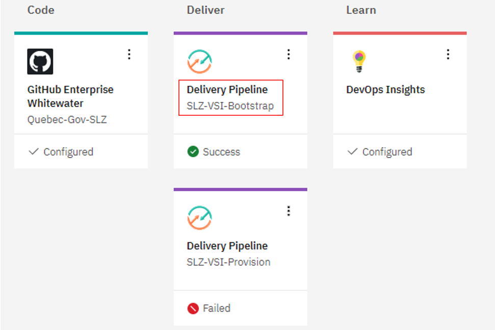
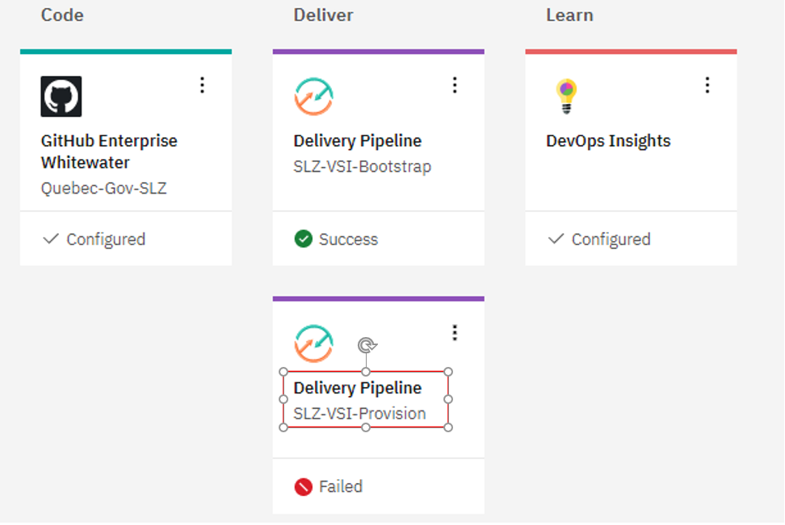
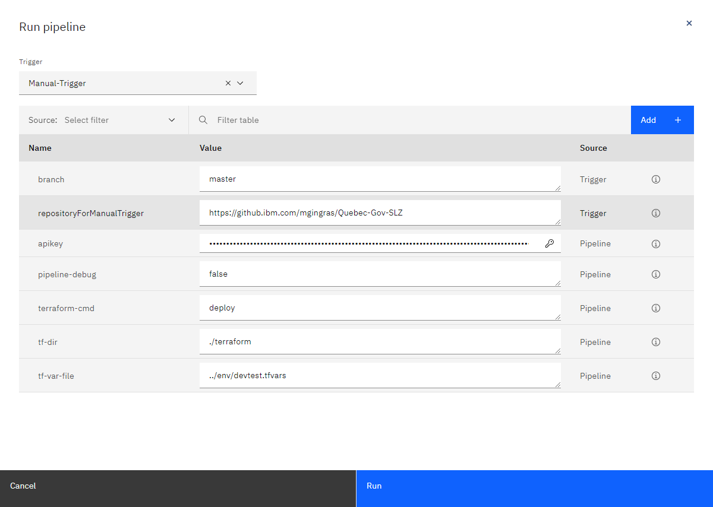
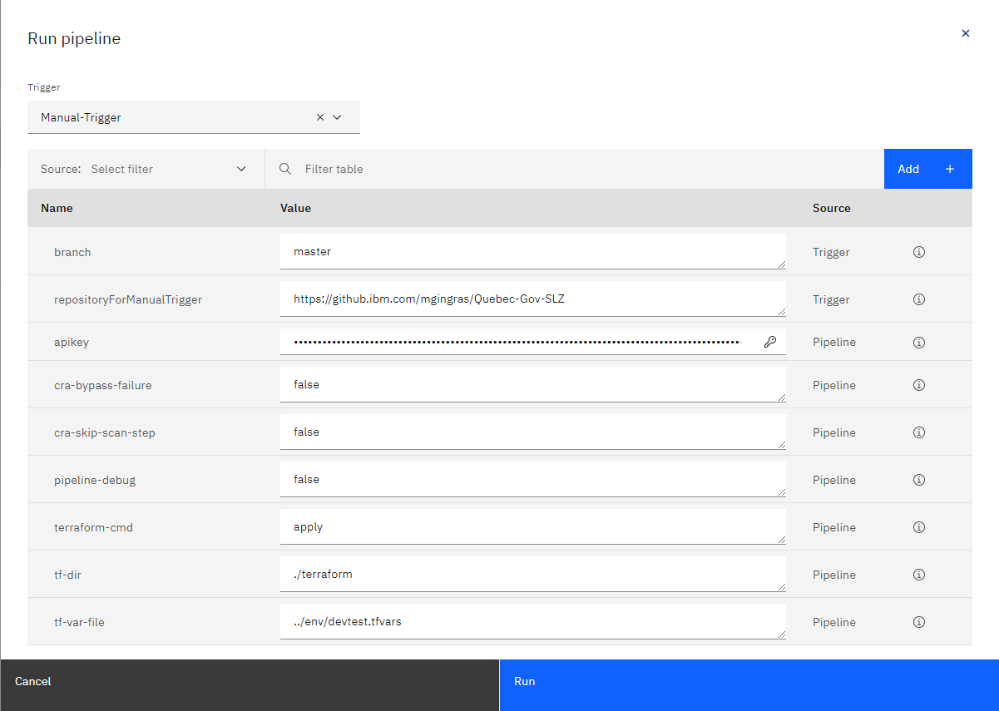

# Déploiement

Créer un service de livraison continue et d'outil d'analyse de code à l'intérieur de ToolChain.

Un déploiement Toolchain est déclenché par un commit de code et récupère les paramètres d'entrée de terraform dans le fichier tfvars que vous avez fourni à Toolchain. À l'aide de ces données, le déploiement sera exécuté après les analyses de code terraform pour valider la conformité par rapport au fichier d'entrée des objectifs stockés [ici](../../terraform/pattern/goal-list.json)


Après avoir connecté le répertoire, vous devez exécuter chacune des étapes suivantes:

1. Mettre à jour le fichier tfvars
2. Créer un Toolchain à l'aide du bouton
3. Éditer les propriétés à l'intérieur du Toolchain
4. Exécuter le Pipeline
5. Configurer le collecteur SCC pour la sécurité (optionel)

Suivez les prochaines étapes pour compléter le déploiement.

## Mettre à jour le fichier tfvars

1. Ce patron a été tsté avec le fichier de variables devtest.tfvars présent dans le répertoire env. Vous pouvez soit faire une copie de [`devtest.tfvars`](../../terraform/env/devtest.tfvars) dans le répertoire __env__ ou créer un nouveau fichier `.tfvars` dans ce répertoire. Mettre à jour votre copie du fichier `.tfvars` avec les valeurs appropriés pour votre déploiement.


   * Les valeurs actuellement en place regroupe tout les éléments dans un même groupe de ressource. Pour utiliser différents groupe de ressource, modifier la valeur pour chacune des entrées `*_resource_group_name` du fichier de variable et retirer le commentaire devant la ligne`*_resource_group_provision="false"`.

   * Si vous désirez utiliser différents groupes de resource, assurez-vous de mettre la valeur de la variable `workload_flow_log_auth_provision` à `true` dans le fichier  variables.tf [ici](../../terraform/pattern/variables.tf)
   
   * De l'aide à propos de la gestion des sous-réseau et de la capacité de traitement se retrouvent [ici](../markdowns/planning_worksheet.md).

   * Veuillez garder à l'esprit, l'instance Cloud Object Storage (COS) instance wavec un bucket pour vos logs de flux doit être un bucket à région unique dans la même région que      la ressource cible.

   * Afin de respecter les conventions d'appellation d'IBM Cloud, lorsque vous éditez votre fichier `devtest.tfvars` vos étiquettes de préfixe doivent comporter 15 caractères        pour le préfixe de dénomination générique. 

   * La longueur maximal pour le nom d'une ressource est de 40 caravtères.

   * Minimum fixé à 25 caractères avec un maximum de 40, laissant 15 caractères pour le préfixe de dénomination générique.

   * Pour les variables nom des ressources, nom du bucket, etc, la valeur doit être unique au sein de IBM Cloud.

Enregistrer vos changement dans le fichier `.tfvars` de votre répertoire.

## Création du Toolchain à l'aide du bouton "toolchain button" à partir de l'URL modifié

* À partir de votre répo connecté, utiliser l'uRL plus bas afin d'effectuer votre déploiement.

* Si vous utilisez une branche à partir d'un répertoire maitre, ajuster le lien en remplaçant le nom de la branche.

   À partir du tableau ci-dessous, la colonne "change", ceci vous permet d'identifier dans le lien les items que vous devraex remplacer en fonction de votre type de répo.

   | Type       | Change       | Input                                                    |
   |------------|--------------|----------------------------------------------------------|
   | connecté   | slzone       | Nom de votre connexion (Fork)                            |
   | branche    | master       | Nom de la branche (Branch)                               |

Avant de copier le lien ci-dessous, ajuster en fonction du tableau ci-dessus.

   ```url
   https://cloud.ibm.com/devops/setup/deploy?repository=https%3A%2F%2Fvotrerépo%2Fslzone%2FQuebec-Gov-SLZ&env_id=ibm:yp:us-south&branch=master
   ```

Après avoir ouvert le lien, se connecter au IBM Cloud avec votre compte.
   
   * Aller à "Delivery Pipeline",

      * Copier la clé API  [IBM Cloud API Key](https://cloud.ibm.com/docs/account?topic=account-userapikey#create_user_key)
      * Le fichier de variable Terraform **.tfvars**  Nous devons passer le fichier .tfvars à partir du répertoire `terraform/env`.
         * exemple: devtest.tfvars*.
         (Ceci est requis avant la création du Toolchain.)

      * Ensuite, cliquer sur **Create**
         * Toolchain creates: DevOps Insight, Git Integration and Devlivery Pipeline.

## Modification des propriétés du Toolchain

* Avant de déclancher le pipeline, l'usager doit ajuster les valeurs dans le fichiers `./terraform/env/devtest.tfvars`  en fonction des valeurs qui seront passées à travers le pipeline.

* Le Toolchain Quebec-Gov-SLZ sera la prochaine écran.

* Le Toolchain utilisera les valeurs du référenciel pour remplir:

   - Nom du Toolchain
   - Région
   - Groupe de ressource
   - Type de répo / URL

## Exécution du pipeline

Le Toolchain devrait créer deux (2) pipeline de livraison, un pour le "BootStrap" et un second pour les services (Provision).
  



### SLZ-VSI-Bootstrap

Un environnement minimal Bootstrap est nécessaire pour lancer et exécuter le code d'automatisation du déploiement de la solution. Bootstrap déploie les ressources qui se retrouve [ici](https://github.ibm.com/fs-cloud-canada/Quebec-Gov-SLZ/tree/master/terraform/bootstrap). Bootstrap crée un service Object Storage et crée un storage bucket qui est utilisé pour conserver l'état de Terraform. Les informations du service Bootstrap peuvent aussi être configurés fichier .tfvars qui est utilisé pour le déploiement du patron.

      
   > Note: Il est recommandé d'exécuter une seule fois BootStrap et de ne plus le réexcuter par la suite. Bootstrap est utilisé pour initialiser l'environnement et ne devrait pas s'exécuter plus d'une fois car les ressources qui sont créé par BootStrap seraient alors doublé.
       
Un guide sur les différentes variables et le type de donnée pouvant être configurés est documenté dans [variable declarations par modules](../markdowns/module_var_declaration.md)  
      
Pour exécuter BootStrap,
      
1. Cliquer sur  **Delivery Pipeline** intitulé **SLZ-VSI-Bootstrap**.  
2. CLiquer sur  **Run Pipeline**.  Mettre à jour les propriétés en fonction de votre environnement. Si vous désirez que les variables demeurent persistentes pour les autres pipeline, vous pouvez les modifier sous **Environment properties**.

   | Nom                   | Valeur             | Défautt |   Description                                                      | 
   |-----------------------|--------------------|---------|--------------------------------------------------------------------| 
   | terraform-cmd         | plan/apply/destroy | plan    | Si l'utilisateur veut exécuter un Terraform Plan, Apply ou Destroy |
   | pipeline-debug        | true/false         | false   | Permet une sortie Debug (**value = true**)                         |

    > Note: Noter que les valeurs "boolean" sont sensibles à la casse


3. Ensuite, cliquer sur **Run** pour déclancher le pipeline.

  
   


Un fois l'exécution réussis de Bootstrap, il transmettra les variables suivantes au pipeline de livraison 

   | Nom                  |  Description                               |
   |----------------------|--------------------------------------------|
   |  bootstrap-bucket    |   COS bucket pour le stockage de l'état    |
   |  bootstrap-region    |   COS region pour le stockage de l'état    |
   |  bootstrap-endpoint  |   COS endpoint pour le stockage de l'état  |
   |  bootstrap-accesskey |   COS accesskey pour le stockage de l'état |
   |  bootstrap-secretkey |  COS secretkey pour le stockage de l'état  |  

Le détails concernant les **COS Bucket** se retouvent sous [resource list](https://cloud.ibm.com/resources) , ensuite **Storage**

+ Sélectionner le Bucket spécifique nouvellement créé ou existant utilisé lors de l'exécution de la commande **RUN PIPELINE**. 

### SLZ-VSI-Provision

SLZ-VSI-Provision déploie les ressources qui se retrouve [ici](https://github.ibm.com/slzone/ra-roks-base-pattern/tree/master/terraform/pattern).

1. Cliquer sur **Delivery Pipeline** intitulé **SLZ-VSI-Provision**.  

2. Cliquer sur **Run Pipeline**. Mettre à jour les propriétés en fonction de votre environnement. Si vous désirez que les variables demeurent persistentes pour les autres pipeline, vous pouvez les modifier sous **Environment properties**.

   | Nom                     | Valeur             | Défaut  | Description                                                         |
   |-------------------------|------------------- |---------|---------------------------------------------------------------------|
   | apply-pattern-extension | true/false         | false   | Si vou désirez déploiyer vpc_lb & app_id lorsque (**value = true**) |  
   | terraform-cmd           | plan/apply/destroy | plan    | Si l'utilisateur veut exécuter un Terraform Plan, Apply ou Destroy  |
   | cra-bypass-failure      | true/false         | false   | Continuer même si erreurs **true= bypass** , **false= No-bypass**   |
   | cra-skip-scan-step      | true/false         | false   | Continuer même si erreurs   **true= bypass** , **false= No-bypass** |
   | pipeline-debug          | true/false         | false   | Permet une sortie Debug (**value = true**)                          |

   >  Note: Noter que les valeurs "boolean" sont sensibles à la casse

    
       

Assurez-vous que les variables suivantes ont été ajusté.

   | Name | Valeur| Défaut |   Description    |
   |------|:-----:|:-------:|------------------|
   |  apikey | Votre api-key | -- | API Key à utiliser pour déclancher le pipeline |
   |  branch| master/any | master | Nom de la branche spcifique utilisé pour exécuter le pipeline |
   |  repositoryForManualTrigger| Votre répo connecté | Votre répo connecté  | Nom de la connexion utilisé pour exécuter le pipeline |
   |  tf-dir| ./terraform | ./terraform | Répertoire Terraform |
   |  tf-var-file| ../env/devtest.tfvars |../env/devtest.tfvars | Répertoire de tfvar |

3. Cliquer ensuite sur **Run** pour exécuter le pipeline.

Durant le processus de déploiement, il y a quelques problèmes connu qui pourrait survenir. Ceux-ci sont documentés [dans un document de dépannage](../markdowns/troubleshooting.md).

**Vérification de Toolchain**

   * Accéder à toolchain [ici](https://cloud.ibm.com/devops/toolchains).
   * Sélectionner le groupe de ressource ainsi que la location ou le pipeline a été créé.
   * Trouver vitrre pipeline dans la liste et valider le status de l'icone.
   * En cas d'échec, cliquer sur le pipeline à partir de la console afin de voir à quelle étapes l'erreur s'est produite.
   
### COnfiguration du collecteur SCC (Optionnel)

Après le déploiement, débuter la **Configuration du centre de sécurité et de conformité** afin d'intégrer les contrôles de sécurité dans les flux de travail quotidiens. [ici](../markdowns/scc_config.md)


Pour détruire les ressources déployés [ici](../markdowns/destroy.md)
